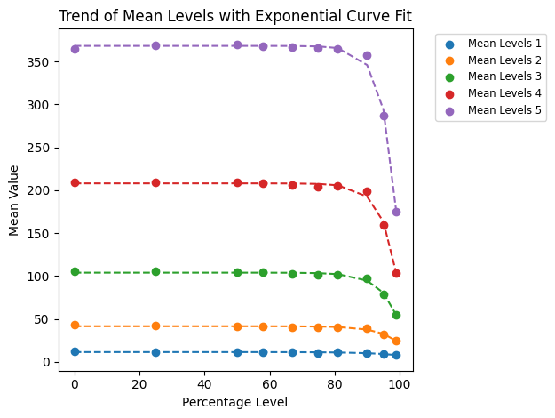
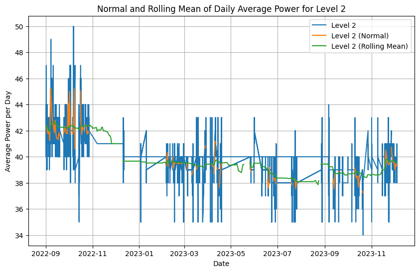

# Air Purifier Filter Replacement Prediction

This project was developed as part of my Bachelor's thesis in Artificial Intelligence and Data at the Technical University of Denmark (DTU), in collaboration with Longhi Air, an Indonesian manufacturer of air purifiers.

The goal of the project was to analyze IoT sensor data from air purifiers and develop data-driven methods to predict when air filters should be replaced.

Replacing filters too early increases maintenance costs, while replacing them too late reduces purification performance. This project investigates whether sensor data can be used to detect filter degradation and predict optimal replacement timing.

---
## Project context

Bachelor's thesis – DTU

Collaboration with Longhi Air (Indonesia)

Focus: predictive maintenance using IoT sensor data

## Repository Structure

- `data/` raw experimental datasets
- `notebooks/` preprocessing, analysis and forecasting notebooks
- `results/plots/` exported visualizations used in the report
- `requirements.txt` project dependencies

## Data Collection

The dataset was collected manually from a device monitoring dashboard that tracks air purifier performance over time.

Sensor readings and device statistics were exported and structured into datasets used for the analysis.

# Dataset

The dataset consists of IoT sensor measurements collected from air purifier devices, including:

- Power consumption
- Fan speed levels
- Environmental sensor readings
- Device usage patterns

The data was collected across multiple experiments designed to simulate filter degradation over time.

Files included:

- `EXP_1.csv`
- `EXP_2.csv`
- `EXP_2v2.csv`

---

## Methodology

The project follows a data science workflow:

1. Data collection from air purifier monitoring dashboard
2. Data preprocessing and cleaning
3. Feature analysis of sensor variables
4. Time-series modeling and forecasting
5. Evaluation of filter degradation patterns

## Example Results

### Filter Degradation Trend

This plot shows how filter performance degrades as particle levels increase.
The exponential curve indicates how quickly different purifier levels accumulate contamination.

### Forecast Example

A TimeGPT model was used to forecast future power usage and detect anomalies in the sensor data.

### Sensor Signal with Rolling Mean

## Technologies Used

Python  
Pandas  
NumPy  
Jupyter Notebooks  
Time-series forecasting (TimeGPT)

## API Token

The TimeGPT API token previously used in this project has been revoked and no longer works.

API keys are intentionally not stored in this repository.  
To run the forecasting notebook you must provide your own API token.

## Bachelor Thesis

The full bachelor thesis describing the methodology,
experiments and results can be found here:

[Read the thesis](docs/Bachelor_Project.pdf)

