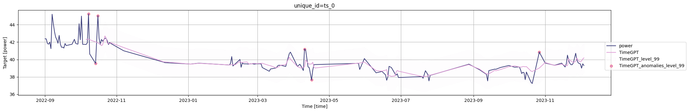

# Air Purifier Filter Replacement Prediction

This project was developed as part of my Bachelor's thesis in Artificial Intelligence and Data at the Technical University of Denmark (DTU).

The goal of the project was to analyze IoT sensor data from air purifiers and develop data-driven methods to predict when air filters should be replaced.

Replacing filters too early increases maintenance costs, while replacing them too late reduces purification performance. This project investigates whether sensor data can be used to detect filter degradation and predict optimal replacement timing.

---
## Data Collection

The dataset was collected manually from a device monitoring dashboard that tracks air purifier performance over time.

Sensor readings and device statistics were exported and structured into datasets used for the analysis.

# Dataset

The dataset consists of IoT sensor measurements collected from air purifier devices, including:

- Power consumption
- Fan speed levels
- Environmental sensor readings
- Device usage patterns

The data was collected across multiple experiments designed to simulate filter degradation over time.

Files included:

- `EXP_1.csv`
- `EXP_2.csv`
- `EXP_2v2.csv`

---

## Methodology

The project follows a data science workflow:

1. Data collection from air purifier monitoring dashboard
2. Data preprocessing and cleaning
3. Feature analysis of sensor variables
4. Time-series modeling and forecasting
5. Evaluation of filter degradation patterns

## Example Results

### Daily Average Power

The experiments showed that sensor data such as fan speed,
power consumption, and environmental measurements can be
used to detect filter degradation patterns.

### Forecast Example

Time-series forecasting models were tested to predict when
filters should be replaced.

## Technologies Used

Python  
Pandas  
NumPy  
Jupyter Notebooks  
Time-series forecasting (TimeGPT)

